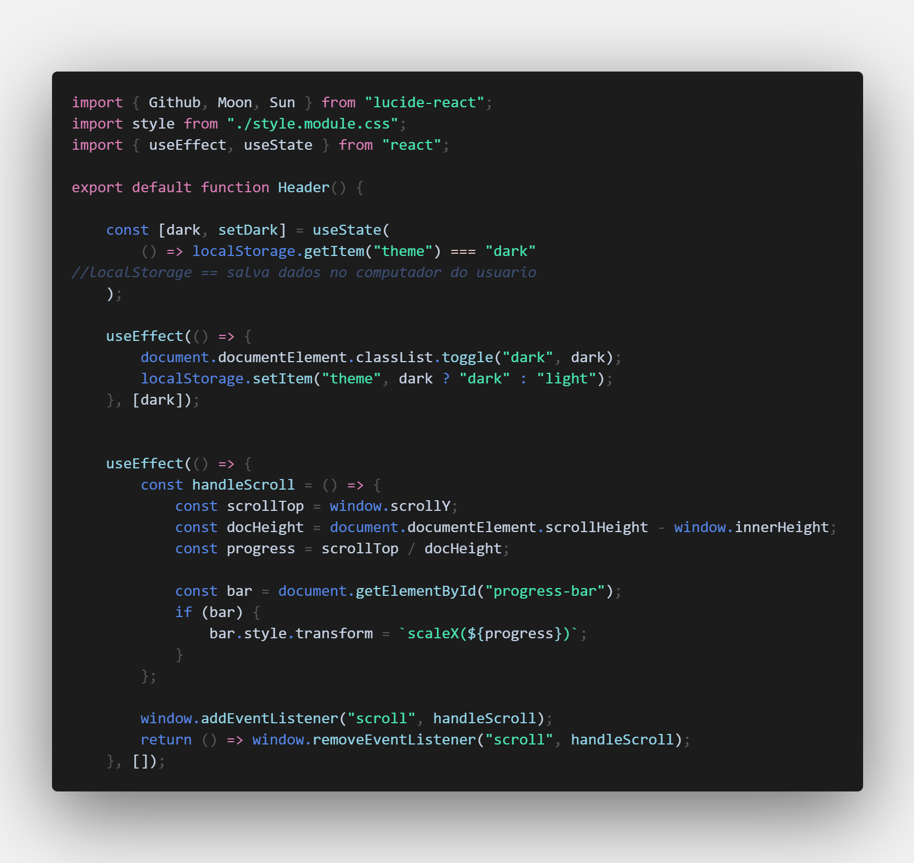
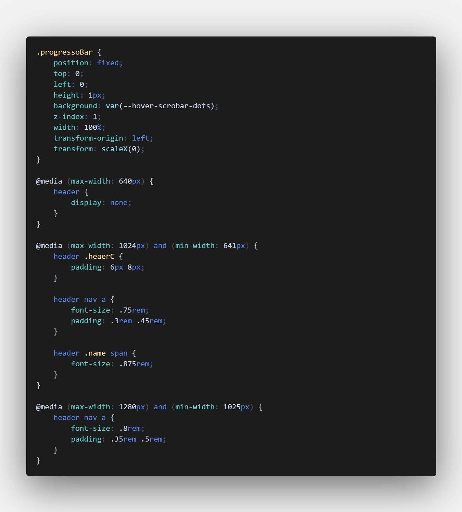

# CleanCode Dark

> A clean and satisfying dark theme for focused coding sessions.

## 🎨 Screenshots

### JavaScript

### CSS

## ⚙️ Installation

1. Open **VS Code**
2. Go to Extensions (`Ctrl + Shift + X`)
3. Search for **CleanCode Dark**
4. Click **Install**
5. Press `Ctrl + K Ctrl + T` and select **CleanCode Dark**

## 🖌️ About

CleanCode Dark is designed to reduce visual noise and keep your focus on what matters — the code.

The palette was carefully chosen to provide:
- clean contrast
- pleasant syntax highlighting
- reduced visual noise
- a modern and focused coding experience

## ✨ Features

- Clean and minimal dark UI
- Balanced and satisfying syntax colors
- Designed for long coding sessions
- Great readability for multiple languages

## 📝 License

This theme is licensed under the [MIT License](LICENSE).

## 👨‍💻 Author

**Pedro Amancio**