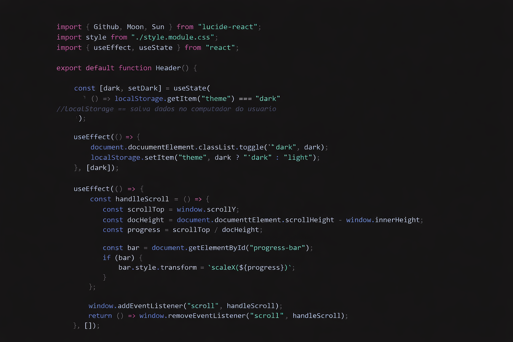
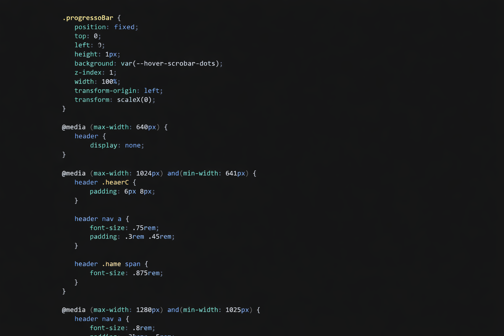

# CleanCode Dark

> A clean and satisfying dark theme for focused coding sessions.

  

## ✨ Features

- Clean and minimal dark UI
- Pleasant and balanced syntax highlighting
- Reduced visual noise for better focus
- Great readability for long coding sessions

## 🎨 Screenshots

### JavaScript

  

### CSS

  

## ⚙️ Installation

1. Open **VS Code**
2. Go to **Extensions** (`Ctrl + Shift + X`)
3. Search for **CleanCode Dark**
4. Click **Install**
5. Press `Ctrl + K Ctrl + T` and select **CleanCode Dark**

## 🖌️ About

CleanCode Dark was designed to keep your editor visually clean, modern and easy to read — without distracting colors or excessive contrast.

## 📝 License

Licensed under the [MIT License](LICENSE).

## 👨‍💻 Author

**Pedro Amancio**